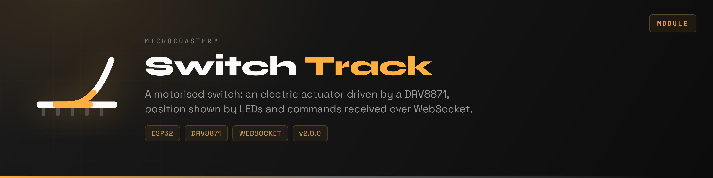
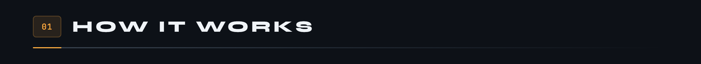
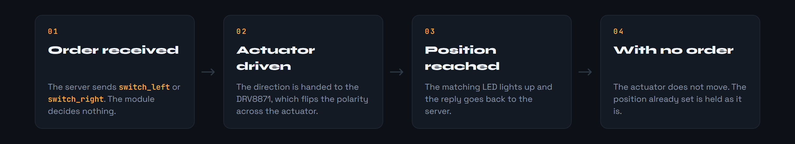
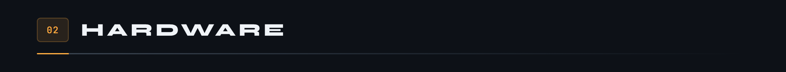
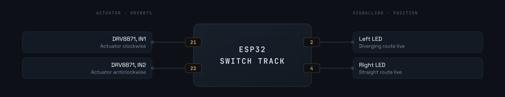
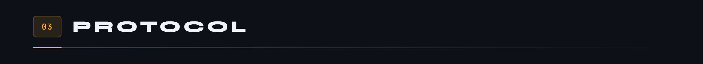
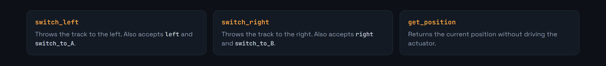
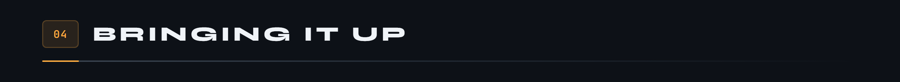
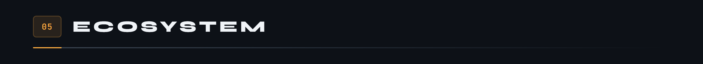

<div align="center">

<p>
  <a href="README.md"></a>
  
</p>



</div>

A motorised switch for MicroCoaster layouts. An electric actuator moves the movable section of track to the left or to the right, two LEDs show the position, and the order arrives from the controller over WebSocket.

Like the other modules, it is configured on first boot through a captive portal, then joins the server.

**Version 2.0.0**



The module decides nothing. It receives a position order, drives the actuator, checks that the position is reached, and reports back. It is the controller that knows whether the track downstream is clear and whether the change is allowed.



The current position is reported on every connection and on every change, so the server never drifts out of step with what the layout is actually doing.





The DRV8871 is an H-bridge: it pulls `IN1` or `IN2` high to reverse the polarity across the actuator, and both low to stop it. Its thermal protection and current limiting keep the actuator from being damaged if the track is jammed.



The module authenticates on connection, then talks JSON.

**Identification, module to server**

```json
{
  "type": "module_identify",
  "moduleId": "MC-0001-ST",
  "password": "<module secret>",
  "moduleType": "switch-track",
  "uptime": 12345,
  "position": "left"
}
```

**Command, server to module**

```json
{
  "type": "command",
  "data": { "command": "switch_left" }
}
```



The module answers every command and sends periodic telemetry with its position and its uptime.

`SERVER_USE_SSL` chooses between `ws` and `wss`. On a local development network, `ws` is enough. In production, or as soon as the server is reachable beyond the home network, switch to `wss`: without encryption, the module's authentication secret travels in the clear.



First copy [`include/env.h.example`](include/env.h.example) to `include/env.h` and fill it in: fallback portal credentials, the module identity and its secret. That file is not in git, and without it the firmware does not compile.

Requires [PlatformIO](https://platformio.org/) inside Visual Studio Code.

```bash
pio run                  # build
pio run -t upload        # upload the firmware
pio run -t uploadfs      # upload the portal to LittleFS
pio device monitor       # serial console, 115200 baud
```

1. Power the module. It creates a WiFi access point.
2. Connect to it and open `http://192.168.4.1`.
3. Enter the target network.
4. The module reboots, joins the network and announces itself to the server.

The WiFi credentials stay in the module's memory, never in the repository.



```ini
links2004/WebSockets        ; link to the controller
bblanchon/ArduinoJson       ; the messages exchanged
ayresnet/AyresWiFiManager   ; captive portal and reconnection
```

Embedded filesystem: **LittleFS**, which holds the portal pages. The common base for every module is the [WiFi Manager](https://github.com/Microcoaster/MicroCoaster_WifiManager), the [LED bench](https://github.com/Microcoaster/ESP-32-led) is its test version without the mechanics, and the driving is done from the [WebApp](https://github.com/Microcoaster/MicroCoasterWebApp).

---

<sub>MicroCoaster · Author: Cybertrist</sub>
