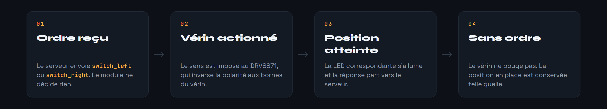
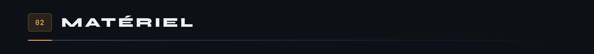
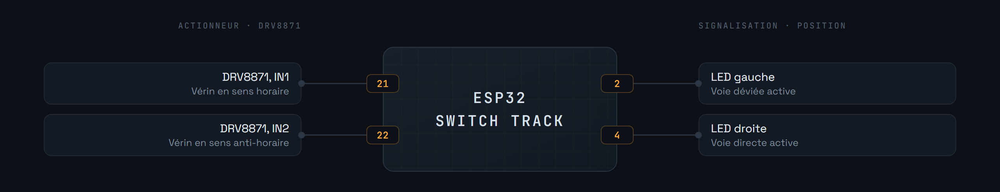
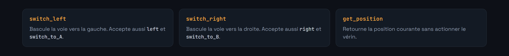

<div align="center">


</div>

Aiguillage motorisé pour circuits MicroCoaster. Un vérin électrique déplace la portion de voie mobile vers la gauche ou vers la droite, deux LED signalent la position, et l'ordre arrive du contrôleur en WebSocket.

Comme les autres modules, il se configure au premier démarrage par portail captif, puis rejoint le serveur.

**Version 2.0.0**


Le module ne décide rien. Il reçoit un ordre de position, actionne le vérin, vérifie que la position est atteinte, et rend compte. C'est le contrôleur qui sait si la voie en aval est libre et si le changement est autorisé.



La position courante est remontée à chaque connexion et à chaque changement, pour que le serveur ne se désynchronise jamais de la réalité du circuit.





Le DRV8871 est un pont en H : il met `IN1` ou `IN2` à l'état haut pour inverser la polarité aux bornes du vérin, et les met tous deux à zéro pour l'arrêter. Sa protection thermique et sa limitation de courant évitent d'endommager le vérin si la voie est bloquée.


Le module s'authentifie à la connexion, puis échange en JSON.

**Identification, module vers serveur**

```json
{
  "type": "module_identify",
  "moduleId": "MC-0001-ST",
  "password": "<secret du module>",
  "moduleType": "switch-track",
  "uptime": 12345,
  "position": "left"
}
```

**Commande, serveur vers module**

```json
{
  "type": "command",
  "data": { "command": "switch_left" }
}
```



Le module répond à chaque commande et envoie une télémétrie périodique avec sa position et son temps de fonctionnement.

`SERVER_USE_SSL` choisit entre `ws` et `wss`. Sur un réseau local de développement, `ws` suffit. En production, ou dès que le serveur est joignable au-delà du réseau domestique, passez en `wss` : sans chiffrement, le secret d'authentification du module circule en clair.


Copiez d'abord [`include/env.h.example`](include/env.h.example) en `include/env.h` et renseignez-le : identifiants du portail de secours, identité du module et son secret. Ce fichier n'est pas versionné, et sans lui le firmware ne compile pas.

Nécessite [PlatformIO](https://platformio.org/) dans Visual Studio Code.

```bash
pio run                  # compilation
pio run -t upload        # téléversement du firmware
pio run -t uploadfs      # téléversement du portail vers LittleFS
pio device monitor       # console série, 115200 bauds
```

1. Alimenter le module. Il crée un point d'accès WiFi.
2. S'y connecter et ouvrir `http://192.168.4.1`.
3. Renseigner le réseau de destination.
4. Le module redémarre, rejoint le réseau et s'annonce auprès du serveur.

Les identifiants WiFi restent en mémoire du module, jamais dans le dépôt.


```ini
links2004/WebSockets        ; liaison avec le contrôleur
bblanchon/ArduinoJson       ; messages échangés
ayresnet/AyresWiFiManager   ; portail captif et reconnexion
```

Système de fichiers embarqué : **LittleFS**, il héberge les pages du portail. Le socle commun à tous les modules est le [WiFi Manager](https://github.com/Microcoaster/MicroCoaster_WifiManager), le [Banc LED](https://github.com/Microcoaster/ESP-32-led) en est la version d'essai sans mécanique, et le pilotage se fait depuis la [WebApp](https://github.com/Microcoaster/MicroCoasterWebApp).

---

<sub>MicroCoaster · Auteur : Cybertrist</sub>
